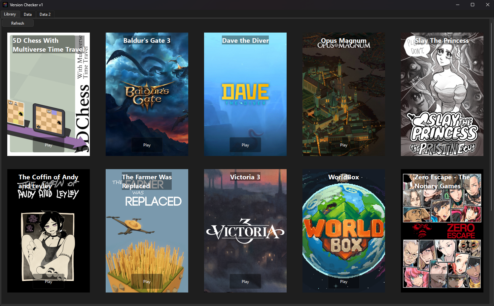
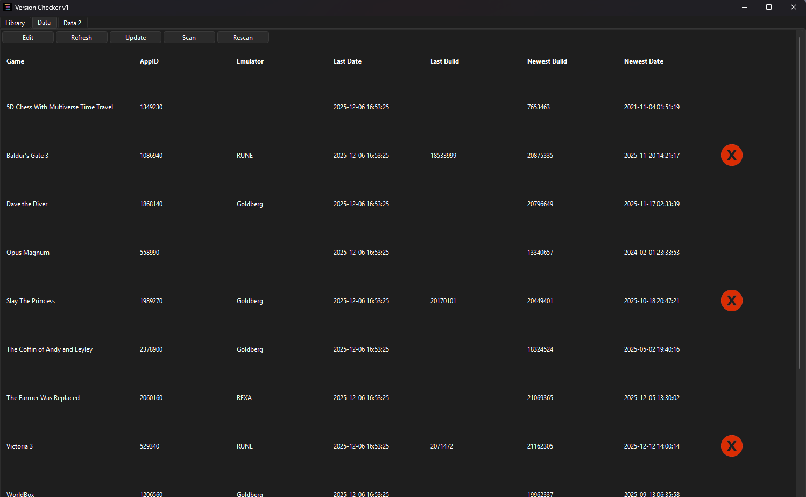

# Steam Proto V1

An Application to easily start Games not obtained via a Launcher. A Launcher replacement.

## Table of Contents
- [Steam Proto V1](#steam-proto-v1)
  - [Table of Contents](#table-of-contents)
  - [Features](#features)
  - [Dependencies](#dependencies)
  - [Setup](#setup)
  - [Guide](#guide)
    - [Library](#library)
    - [Data](#data)
  - [License](#license)

## Features

- easy game access via a Library

- easy comparison of game versions (current and new)

- optional comsetics (e.g as in image 1)

## Dependencies

- an up-to-date version of SteamCMD

Download from:
https://developer.valvesoftware.com/wiki/SteamCMD

Ensure `steamcmd.exe` is available in PATH or configure its location.

## Setup

1. Download the ZIP package and place it into your Games Folder (the top folder is game dir, where all games are located).
2. Execute the window.pyw application and wait a short time for it to scan your game folders.
3. Now, on the Tab labeled 'Data', you must hit 'Edit' and enter the AppIDs of games where there is none yet. Save with 'Save', confirm and then in the main application click 'Update'.
4. In the last Tab labeled 'Data2' you must again hit 'Edit' and click on the buttons for each game, giving the game's exe location. Afterward again hit 'Save' and confirm.
5. Done! To start the application open `window.pyw`, to get cosmetics or use as update Logger please refer to the [Guide](#guide).

## Guide

### Library

To use the Library, simply press 'Play' to start the application

Refresh refreshes the Library's Options

To get banners for your games, go to Data2, click 'Edit' and in the 'img' tab click on each of the buttons to open steamgriddb. Click on the desired banner, then save its path with 'save image location' and close the browser. Paste into the newly opened window and press 'Download'. Repeat for all games.

### Data

In the data table you can see the AppID of the Game, its emulator (not reliable), the date on which this data was last edited, the current build (unreliable), the newest build (from SteamCMD), and the publication date of that build.

The indicator on the far right gives information on whether the current build version, and the newest are identical. If not, the red 'X' indicates a mismatch, a newer update being available.

By clicking 'Edit', you open an Editor, where you are able to change the Data (but for the SteamCMD derived data). You can then save changes using 'Save' or discard by exiting with 'Exit'. 

'Refresh' refreshes the window.

'Update' checks all Data from SteamCMD anew, for whether a new update is out. Do this at least once a week to have accurate data.

'Scan' scans the folders for (new) games and adds them to the data. Do this after installing a new game to be able to access it later in Library.

'Rescan' scraps all previous data and writes it all anew. Only do this when instructed by Problemsolving or when any other issue arises. It is NOT advised to do this.

Data2 acts the same, yet the exe file location is displayed and stored, as well as PNG configurations (as by Browser)

### Settings

In the Settings you can configure wether 
  1. it should be scanned automatically for new versions with `Automatic Scans`
  2. how frequent the scans are with `Scan Frequency`
  3. the design of the app with `design` (Light <-> Dark) [IN_PROGRESS]

## License

This project is licensed under the MIT License. Refer to License.txt.